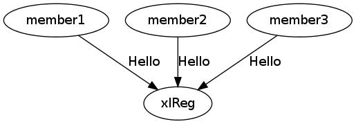
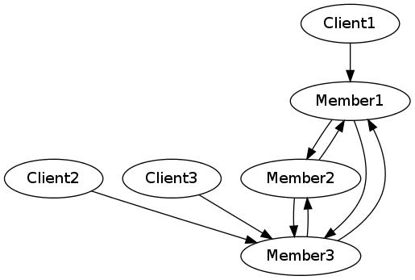

# xlreg_r

A Ruby client for the xlReg cluster registry.  **xlreg_r**
makes it easy to create new small clusters some or all of whose members are
written in Ruby.  xlreg_r is expected to be used primarily
for testing, where
the ability to create and launch new, unique, distinct clusters in seconds
will be a major advantage.

## The xlReg Service

[xlReg](http://jddixon.github.io/xlReg_go)
is a service which provides its clients with unique nodeIDs and allows them
to register and join new clusters and collect configuration information
about existing clusters.

An xlReg cluster is a number of machines
which cooperate as a set of intercommunicating servers.  Each
such server has two RSA keys.  One, the **sig** key, is used for creating
digital signatures.  The other, the **comms** key, is used for encrypting
communications; most often the comms key is used for creating keys for
block ciphers. That is, the comms key is used only for agreeing on the
much faster block cipher key used during the rest of the communications
session.

Each xlReg cluster member also has at least one IP address used for
intra-cluster communications, for communications between members.  In some
clusters each member will also have a second IP address used for communications
with cluster clients.

The xlReg server itself, its clients, and so the cluster members all are
or behave like
[XLattice nodes](http://jddixon.github.io/xlNode_go).
That is, they are self-contained fault-tolerant entities with some
persistent store.  These nodes may be located anywhere on the global
Internet, or on private networks with access to the network in which
an xlReg server resides.`

Like any XLattice node, the xlReg client can either be configured with some
specific keys at start-up or it will generate a new pair of  keys and save
them to persistent store.

## Registration

A booting xlReg client establishes an encrypted connection to the xlReg server.
If this is its first conversation with the xlReg server, the client then
provides the server with configuration information including its RSA public
keys.  (The client does **not** register its secret RSA **private** keys.)
The configuration information is signed with the applicant's private
*sig" key.  The server uses the
client's RSA public key, provided as part of the configuration information, to
verify the client's digital signature on the configuration data.  This proves
that the configuration information is intact and that the applicant has the
private key corresponding to the public key.  In other words, the server has
in a certain sense confirmed the applicant's identity.  Having done this,
the xlReg server issues the client with a unique node ID, a 32-byte value,
completing client registration.

Once an xlReg client has identified itself to the registry it can

1. register new clusters or
2. join existing clusters or
3. get information on existing clusters.

The third option is used, for example, by nodes intending to become clients
of an existing cluster.

## Acquiring Configuration Data

After a new member has joined a cluster the server provides it
with cluster configuration data.  This includes

* the cluster name,
* the cluster ID, and
* the cluster size, the  maximum number of cluster members

It also includes for each current cluster member the member's

* nodeID,
* IP address(es),
* **sig** RSA public key, and
* **comms** RSA public key

The new cluster member can then use this information to communicate with
other members.  Cluster members need no further assistance from the
xlReg server.

Cluster members will communicate with one another and clients
using protocols agreed-upon among themselves, but the xlReg registry
has no knowledge of such protocols.

**xlreg_r** is currently in development.  This is not
necessarily a description of running code; it is where we are going.

xlReg is an [XLattice](http://jddixon.github.io/xlattice_go/) project.  More
detailed (but somewhat dated) conceptual information on XLattice
is available at the [2003-2006 Java XLattice website](http://www.xlattice.org).

xlReg servers and clients communicate using the
[Gooble Protocol Buffers](http://code.google.com/p/protobuf/)-based
[xlReg protocol](http://jddixon.github.io/xlReg_go/xlReg_protocol.html).
An xlReg server has been in test for several months.

## Public Development Server

There is currently an xlReg server running on stockton.dixons.org:55555,
with the public keys shown in the registry credentials below.

	regCred {
	    Name: xlReg
	    ID: 1a6d61d4358a3573d00af2c4cbdcaa28a5115bfc86d0810e48d3f19e79fafc94
	    CommsPubKey: ssh-rsa AAAAB3NzaC1yc2EAAAADAQABAAABAQCdgsWeYYR9qesY4fwLNKu/Ttn7Upce6pNWWRNOeZo3KBO0PMyxUAL5m2eNcCty8YzCuPRYpRBPzRlA8+6Hfd3xCUXxKso7ZvBJTJAXlBS+3YAhZamyN2/0BtXSj52NNA3Xi2qN1nmX98dV8v/q7uRdUzsImcfKrfmxxtUyyKRXCmgk5gUF0r2gdIf1mKIvRpb68RDy6kByMOmwySPQ27bU1L+f7GOtzX3LYD5z6b5pzei1OOO6AiWJ+xqcFFdnXWrTtrqgr0lFgAmXtoriegI3u/8Tc5SUpQrwZsp1gKwmHlNK+6T05NicC1O4WQ+7sONeFASMr/6dvsvrYsSiaI4/
	
	    SigPubKey: ssh-rsa AAAAB3NzaC1yc2EAAAADAQABAAABAQC/hU1g8KyCJJ+DQZbhUeaQpDU1hBuCsS0D+jTphTGgHHC8YzyAZQ8zAIpRZoPu2xueP8I3gLZ3h+MIAujRAAjmWIGdmd6JiKhd4GPBYTHnXszlxABzA0Io269bNw3q4ggrhDxp9hyDSahST6Vs1+8lb0DCiTS7sIS44GqsPwXk3Jake1KEKykp+5sqDzO6fFMCAqwxCBmqHyAE5KwC2s+UCLD7Ivou+Wsmc0vM+XEGOPrYoU56rJESGgmtTOhCeurMhuiiG7E6gV+UhKaCVSvZOghuLDflqZLPGRD/kZ9lJsS9bIbVCPNHfmEzGD7vIVVxQi5ShP0ne7CS2/qNtrQf
	
	    EndPoints {
	         TcpEndPoint: 50.18.104.7:55555
	    }
	    Version: 0.5
	}

The IP address in the reg credentials above is of course that of stockton.dixons.org.

## Server Implementation

The xlReg server and its supporting libraries arehttps://www.google.com/ written in
[the Go programming language](http://golang.org), a high-performance
systems programming language incorporating certain features of
[Tony Hoare](http://en.wikipedia.org/wiki/Tony_Hoare)'s
revolutionary **CSP**,
[Communicating Sequential Processes](http://www.usingcsp.com).

Google's Go language is a stable product.  It has been available for 
several years and the compiler is widely acknowledged to be very fast
and to generate fast, compact code.  The Go language itself --
the compiler and its libraries -- is free and open source.

## Server Source Code

Software developers can currently obtain the xlReg server source code at
[xlReg_go's Github project page](https://github.com/jddixon/xlReg_go/)
so that if you are impatient to begin using xlReg you can build and operate
your own server.

## Client Source Code

This is best obtained through
[this client's Github project page](https://github.com/jddixon/xlreg_r/).

## Project Status

The xlReg server is currently a good beta: it is reasonably reliable and
there are no known serious bugs.

**This client is itself pre-alpha:** some minimal code exists, but nothing
beyond reading the registry credentials (`regCred.dat`) and going through
the initial hello/reply session with the server, xlReg.
